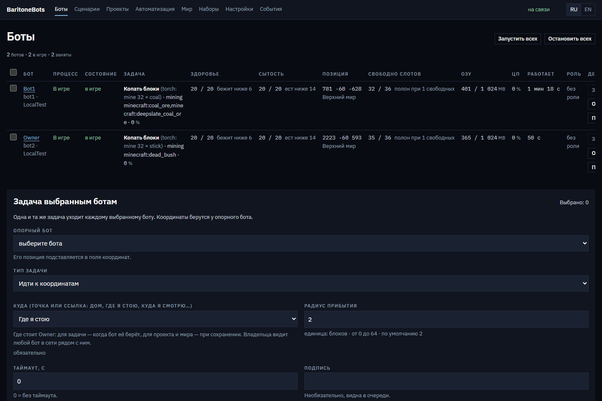
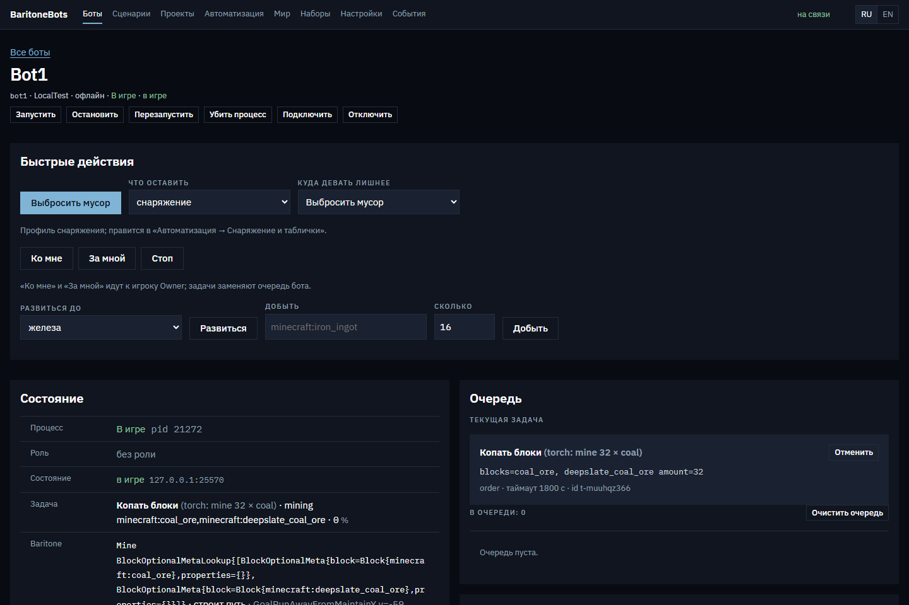
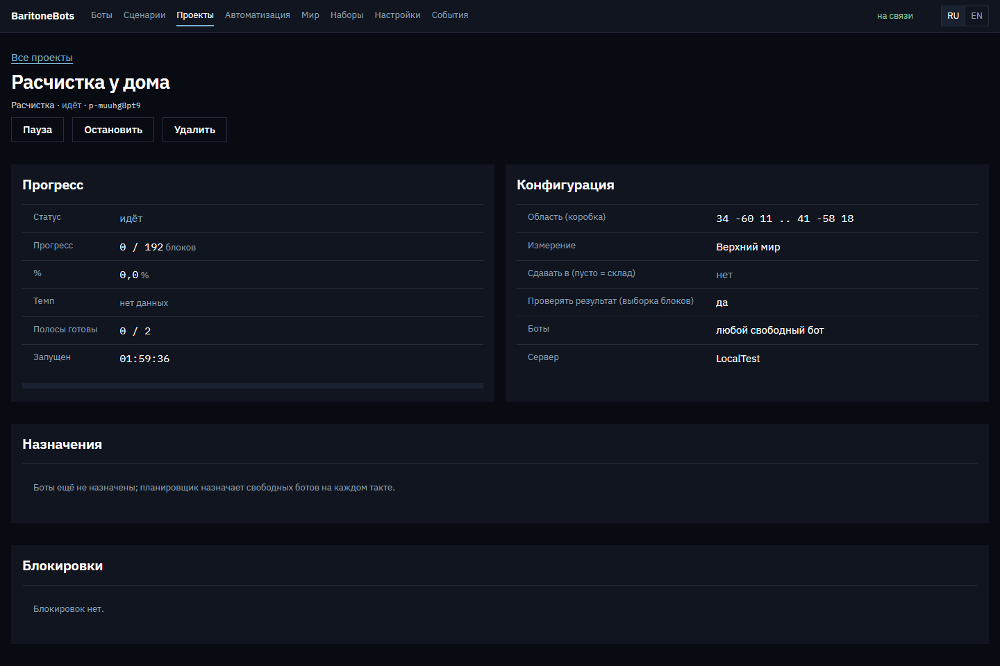
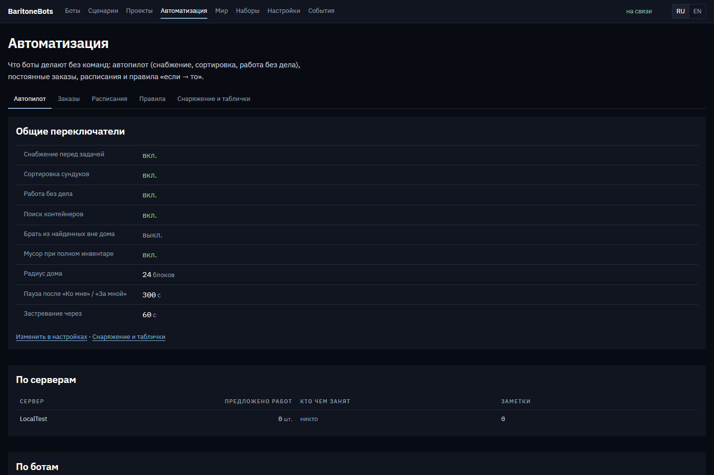

**Русский** · [English](README.en.md)

# BaritoneBots


Боты для Minecraft Java 26.2, которые сами решают, что им для работы нужно.
Перед задачей бот смотрит в свой инвентарь, идёт к сундукам за нужной киркой,
едой и материалами, а не стоит с пустыми руками и ошибкой «нечем копать».

Каждый бот — настоящий клиент Minecraft без окна, а ходит и копает он через
Baritone. Управление идёт из веб-панели на том ПК, где запущены боты. Вы выбираете,
что сделать: «построить по схематике», «держать на складе 128 факелов» или
«развиться до железа». Работу между ботами менеджер делит сам.



## Что умеет

- **27 задач для бота**: ходьба, следование, добыча, ферма, расчистка, заливка
  областей, стройка по схематике, сундуки, крафт, плавка, животные, бой,
  охрана, возврат за вещами после смерти, любая команда Baritone.
- **Сам находит сундуки** вокруг себя и дома, заглядывает в них и помнит, что
  где лежит. Размечать склад вручную не нужно.
- **Автоснабжение**: перед задачей бот берёт инструмент нужного уровня, еду,
  блоки и материалы. Сломалась кирка — сходит за новой.
- **Автосортировка**: лут из приёмных сундуков разносится по 9 категориям,
  а пустой сундук сам получает категорию по тому, что в нём лежит.
- **Цели вместо команд**: «добыть деревянную кирку» или «развиться до железа».
  Рецепты, дроп и уровень кирки берутся прямо из файлов игры 26.2: 1491 рецепт,
  1113 таблиц дропа.
- **7 видов совместных проектов**: стройка, добыча по квоте, расчистка, ферма,
  загон, сортировка, плавка. Роли из 10 вариантов раздаются автоматически
  и переходят туда, где не хватает рук.
- **Держать запас, расписания, правила «если — то»**: «на складе всегда 64 хлеба»,
  «собирать урожай каждые 30 минут», «HP ниже 6 — домой».
- **Анти-иксрей**: на сервере со скрытой рудой бот копает ветками на лучшей
  высоте и берёт только руду, которую видит.
- **Плагин-компаньон** для своего сервера: проверка ботов по токену, журнал
  блоков с откатом, авто-логин AuthMe/nLogin. Без плагина всё остальное работает.


## Как это выглядит







## Предупреждение

Это бета. Мод, менеджер и плагин собраны и покрыты 269 тестами, но часть
функций ещё не прошла проверку в живой игре, а в панели нет экранов для
проектов, расписаний и правил: они пока настраиваются через API. Таблица
ниже показывает, что проверено на настоящем сервере.

Обхода античитов в проекте нет. Baritone на чужом сервере — на ваш риск и
по правилам этого сервера.

## Проверено на сервере

Paper 26.2 build 129, офлайн-режим, плоский мир, 2026-10-04:

| Что | Результат |
|---|---|
| Запуск бота до входа на сервер | 50–65 s |
| `goto` на 22 блока | 4 s, остановился в 2 блоках от цели, допуск 2 |
| Снаряжение из сундука | взял железный сет, меч, лопату и 8 из 16 хлеба, надел броню |
| `mine` земли, цель 6 | собрал 9, лопату выбрал сам |
| Цель «деревянная кирка» с пустым инвентарём | брёвна → доски → верстак, поставил его сам → палки → кирка, 118 s |
| Автоснабжение | осмотрел 3 сундука, взял брёвна, скрафтил 8 досок |
| Автопилот в простое | сам отнёс сырую руду со склада в печь |
| Плагин-компаньон | бот прошёл проверку по токену, журнал отвечает |

Ещё не проверялись в игре: стройка по схематике, животные, плавка до конца,
проекты с несколькими ботами, Microsoft-аккаунты.

## Сколько потребляет

| Процесс | RAM |
|---|---|
| игра бота | 900 MB, из них heap 300–430 MB при лимите 1024 MB |
| лаунчер HeadlessMC | 102 MB на бота |
| менеджер | 111 MB на всех |

В простое бот тратит 0.07 секунды CPU в секунду, это около 7% одного ядра.
На 5 ботов выходит около 5 GB RAM. Мод не рисует кадры, не играет звуки и держит
дальность прорисовки 4 чанка. Память на бота задаётся пресетом: eco 768 MB,
normal 1024 MB или performance 2048 MB.

## Быстрый старт

### Готовая сборка

1. Установите Java 25, например Temurin.
2. Скачайте `baritonebots-manager-*.jar` из [Releases](https://github.com/KrekerDM/BaritoneBots/releases) в пустую папку.
3. Запустите:
   ```bash
   java -jar baritonebots-manager-0.3.0-beta.1.jar
   ```
   Панель откроется в браузере, адрес с токеном менеджер печатает в консоль.
4. «Настройки» → «Серверы»: адрес сервера. Если там скрыта руда, включите
   анти-иксрей в профиле сервера.
5. «Настройки» → «Боты»: добавьте ботов с офлайн-аккаунтами.
6. «Настройки» → «Окружение» → «Установить». Менеджер скачает HeadlessMC,
   Fabric, Fabric API, Baritone, FerriteCore и Minecraft 26.2.
7. Запустите ботов и давайте им задачи на странице бота.

Данные лежат в `BaritoneBots-data` рядом с jar: настройки, токен панели,
пароли ботов. Не публикуйте эту папку.

### Из исходников

```bash
./gradlew build
```

Нужна Java 25. Готовые jar лежат в `manager/build/libs`, `bot-mod/build/libs`
и `companion-plugin/build/libs`. Мод уже вшит в jar менеджера.

## На своём сервере

- **AuthMe / nLogin.** Бот сам вводит `/register` и `/login`. Пароль менеджер
  генерирует для каждого бота, его видно в «Настройки» → «Боты».
- **DiscordSRV.** Если сервер требует привязку, впишите ботов в
  `plugins/DiscordSRV/linking.yml` → `Bypass names`.
- **GrimAC.** Исключение для своих ботов через LuckPerms:
  ```
  lp creategroup bots
  lp group bots permission set grim.exempt true
  lp user Bot1 parent add bots
  ```
  Grim проверяет право каждый тик, перезаходить не нужно. В офлайн-режиме
  право привязано к нику, поэтому задайте ботам длинные пароли. С плагином-компаньоном
  можно выдать `grim.exempt` только ботам, которые прошли проверку по токену.
- **Плагин-компаньон.** Установка и настройки — в [docs/PLUGIN.md](docs/PLUGIN.md).
- **Локальный ИИ, по желанию.** Поле команд («развиться до железки») и диспетчер
  проектов через Ollama на этом же компьютере; по умолчанию выключено. Установка
  и границы — в [docs/AI.md](docs/AI.md).

## Как это устроено

| Часть | Что делает |
|---|---|
| `manager` | Один jar: ставит Minecraft, Fabric и моды через HeadlessMC 2.10.0, запускает и перезапускает ботов, держит очереди, проекты, автопилот и сведения о мире, отдаёт панель на `127.0.0.1:8765`. |
| `bot-mod` | Fabric-мод внутри каждого бота: выполняет задачи через API Baritone, сообщает состояние, логинится, переподключается, ест, отбивается, встаёт после смерти. |
| `companion-plugin` | Необязательный плагин Paper 26.2 для своего сервера. |
| `common` | Протокол между частями и чтение схематик `.schem` и `.litematic`. |

Менеджер говорит с ботами по TCP на `127.0.0.1`, отдельный порт на сервере не
нужен. Планировщик каждые 5 секунд раздаёт работу свободным ботам, а ручные
задачи всегда важнее проектных. Протокол и все настройки описаны в
[docs/SPEC.md](docs/SPEC.md), решения при разработке — в
[docs/dev/DECISIONS.md](docs/dev/DECISIONS.md).

## Ограничения

- Один бот — один процесс примерно на 1 GB. Несколько ботов в одной JVM
  Baritone не поддерживает.
- Бот ходит пешком: телепортов нет.
- Менеджер знает содержимое сундука только после того, как бот его открыл.
  Новый склад бот сначала обходит и осматривает.
- Ресурсы только честные: всё, что бот не может добыть, скрафтить или
  переплавить, попадает в список «поставить вручную» с нужным количеством.
- Под анти-иксреем добыча медленнее: бот роет ветки, а не идёт к руде напрямую.
- ИИ работает только через локальную Ollama: модели 7B нужно около 5 GB памяти,
  а ответ занимает секунды. Облачных моделей нет.

## Лицензия

MIT. Baritone распространяется по LGPL-3.0, менеджер скачивает его отдельно,
в репозиторий он не входит.
